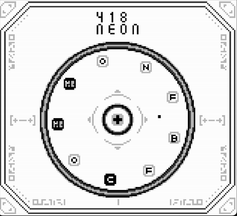

# AtomasGB  

Welcome to the Game Boy version of Atomas!

How to Play:

Press the (A) button to place the center atom into the circle.

Use the left and right arrow keys to move the placement cursor.

If a plus atom is placed between two identical atoms, they will merge into the next higher element (chain reactions are possible).

When a minus atom appears in the center, you can absorb an atom from the circle by pressing (A).
After absorbing, press (B) to either convert the absorbed atom into a plus or insert it back into the circle with (A).

The game ends when the circle contains 12 atoms—so plan carefully and try to reach the highest element possible before that happens!

## Download Rom

[itch.io](https://luxon-pi.itch.io/atomasgb)

## Compilation  

To compile the game, use [GBDK-2020](https://github.com/gbdk-2020/gbdk-2020).  
